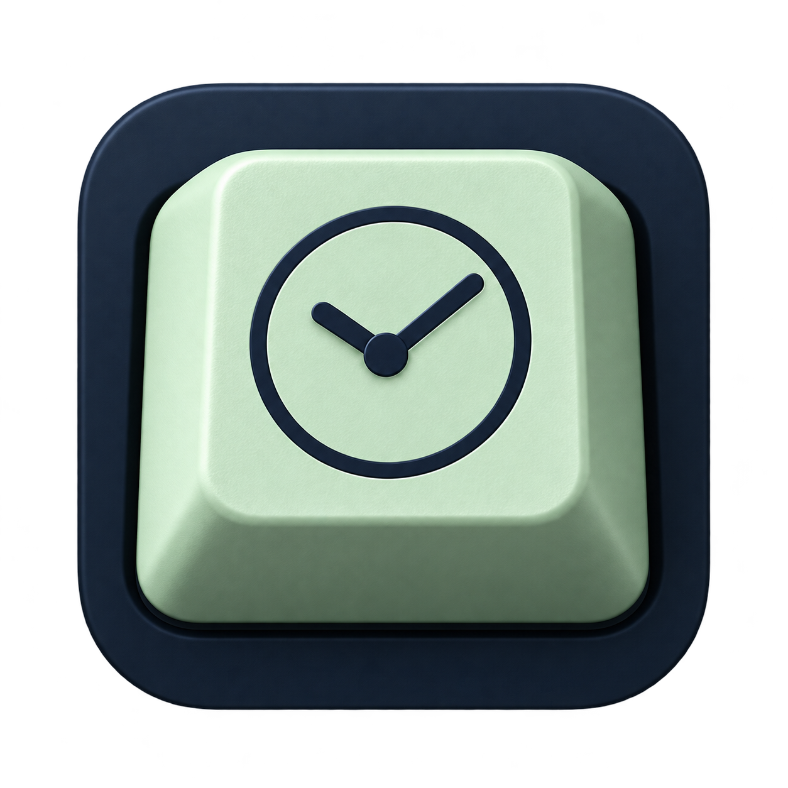
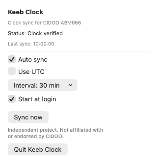

# Keeb Clock



Keep your CIDOO ABM066 keyboard's screen clock in sync with your Mac.
Use the native menu bar app for automatic syncing or the standalone CLI for
manual updates.

**Unofficial project. Not affiliated with or endorsed by CIDOO.**

## Compatibility

- CIDOO ABM066 connected over USB. Bluetooth syncing is not supported.
- macOS 13 or later is required.
- **Only tested on Apple Silicon Macs.** The app also builds for Intel Macs,
  but Intel compatibility has not been verified.

## Menu bar app



*Menu preview with sample sync data.*

### Install from a release

1. Open the [Releases page](https://github.com/howellzach/keeb-clock/releases) and
   download `KeebClock-<version>-macos-universal.zip` from the release assets.
2. Unzip it and drag **Keeb Clock.app** into **Applications**.
3. Connect your keyboard over USB and open **Keeb Clock** from Applications.
   It runs in the menu bar, without a Dock icon or a main window.

Release downloads do not require Xcode or Go. To update, quit the app and replace
it in Applications with the newer version.

These builds are locally signed and **not notarized**. If macOS blocks the app
because the developer cannot be verified, and you trust the download, attempt to
open it, then go to **System Settings → Privacy & Security → Open Anyway**.
See [Apple’s guidance](https://support.apple.com/102445) for details.

### Build from source

You need Xcode 16 or later with Swift 6. From the project root:

```sh
sh scripts/build.sh
sh scripts/install.sh
```

Launch **Keeb Clock** from Applications and click its clock-keycap menu bar icon.
The app syncs on launch, after waking, and every 30 minutes by default.

From the menu you can:

- Sync now or turn automatic syncing off.
- Choose a 5, 15, 30 or 60 minute interval.
- Switch between local time and UTC.
- Start the app at login.

Connection status updates when the keyboard is plugged in or removed.
Reconnecting syncs the clock when automatic syncing is enabled.

Once installed, the app runs on its own without Xcode or the CLI.
The source-build installer keeps a backup of the previous app when updating.

## Command-line tool

### Install from a release

Download the CLI ZIP from the [Releases page](https://github.com/howellzach/keeb-clock/releases)
and unzip it. Choose `macos-arm64` for Apple Silicon or `macos-x86_64` for Intel,
if that architecture is available in the release.

In Terminal, change to the extracted folder and run:

```sh
./keeb-clock devices
./keeb-clock sync-time
```

Go is not required to run the downloaded CLI. These downloads are also locally
signed and not notarized; the macOS approval guidance above applies.

### Build from source

You need Go 1.24 or later. From the project root:

```sh
sh scripts/build-cli.sh
./build/keeb-clock devices
./build/keeb-clock sync-time
```

Use `sync-time --utc` for UTC or `sync-time --dry-run` to read the configuration
without updating the clock. Use `--help` for more options.

The CLI builds for your Mac's architecture and works independently of the app.
See the [CLI README](cli/README.md) for its experimental image helpers.

## Troubleshooting

If syncing fails, reconnect the keyboard over USB and try **Sync now**.
If the problem persists, quit and reopen the app.

For other errors, report an issue with the full error message, your macOS
version and whether your Mac uses Apple Silicon or Intel.

## Releases

Update the version and build number in `Config/Version.xcconfig`, then push a
matching version tag such as `v1.1`. The release workflow runs tests and creates
a draft GitHub Release with the app ZIP, a CLI ZIP for the build Mac's architecture,
and checksums. Test the downloads and review the notes before publishing the draft.

## Licence

Licensed under the [MIT License](LICENSE). Third-party dependencies retain their
own licences; see [third-party notices](THIRD_PARTY_NOTICES.md).

## Acknowledgements

Made possible by [ricardobeat's CIDOO ABM066 research](https://github.com/ricardobeat/cidoo-abm066-tool),
which documented the keyboard's HID protocol and clock configuration.
The upstream tools are not bundled with or required by Keeb Clock.
